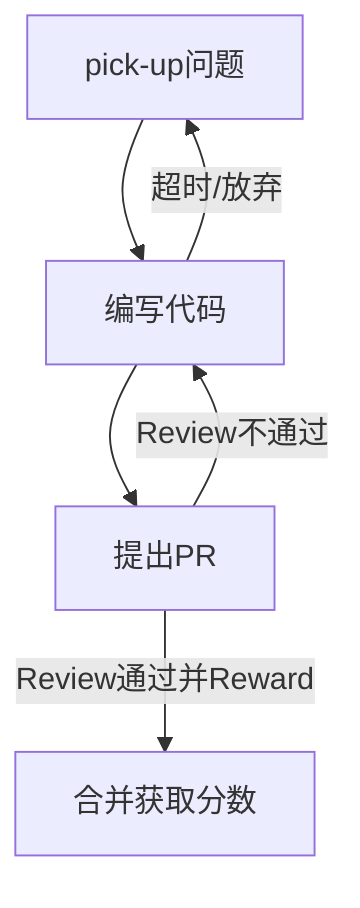

# 整体设计

## 实现思路

使用 [probot](https://github.com/probot/probot) 作为基础框架，利用它接受 Issue 和 PR 的事件来响应。

最终程序会作为一个 GitHub APP 被安装在各个需要参与该活动的库中（**因为目前该 bot 会在仓库中读取配置文件，
所以只支持 Public 的仓库**）。

## 主要监听事件

### issue_comment.created(注意 GitHub API 中 issue 和 PR 的 comment 接口是同一个)
- /ping(Issue): ping bot 是否存活。
- /pick-up(Issue): 申请挑战 issue。
- /give-up(Issue): 放弃挑战 issue。
- /reward(PR): 指定该 PR 可获得奖励数值。
- lgtm(PR): 监听 lgtm 的命令，如果当前 PR 还未 reward，则提醒 mentor 进行 reward 操作（**WIP**）。
    
### pull_request.closed
检查是否关联 challenge issue，如果该 PR 成功合并，则进行加分操作。

- 积分: 根据 reward 加分，**如果未 reward 则视为普通 PR，不予加分**。

## 挑战流程

