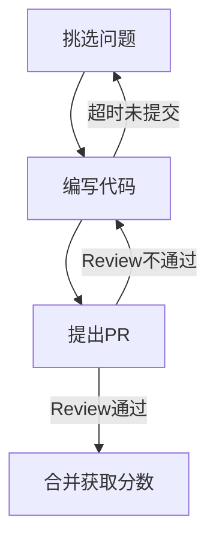

# 整体设计

## 实现思路

使用 [probot](https://github.com/probot/probot) 作为基础框架，利用它监听 Issue 的 comments 和 PR 的 close 事件来进行分配和积分。

最终程序会作为一个 GitHub APP 被安装在各个需要参与该活动的库中。

## 主要监听事件

### issue_comment.created(注意 GitHub API 中 issue 和 PR 的 comment 接口是同一个)
- /pick-up-challenge: 申请挑战 issue。
    - 附加操作:　将该 issue 分配给 challenge-bot，并在 issue 描述中声明目前的 pickup 情况。**并且打上 picked 的标签。**
- /give-up-challenge: 放弃挑战 issue。
- /reward(PR): 指定该 PR 可获得奖励数值。
    - 附加操作: **打上 reward 的标签。**
    - 要求1: 该 PR 关联了 challenge 的 issue。
    - 要求2: 只能该 issue 的 **mentor** 使用该命令。
    - 要求3: reward 的分数小于等于 issue 的分数。
- lgtm(PR): 监听 lgtm 的命令，如果当前 PR 还未 reward，则提醒 mentor 进行 reward 操作。
    
### pull_request.closed
检查是否关联 challenge issue，如果该 PR 成功合并，则进行加分操作。

- 积分: 根据 reward  加分，**如果未 reward 则记 0 分**。

## 挑战流程

