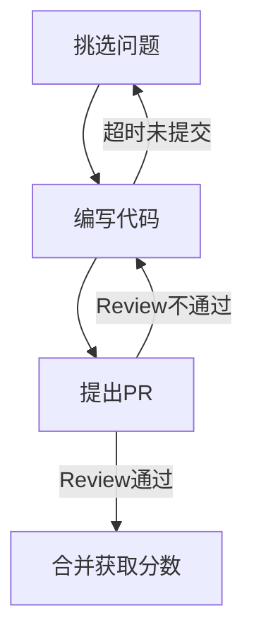

# 整体设计

## 实现思路

使用 [probot](https://github.com/probot/probot) 作为基础框架，利用它监听 Issue 的 comments 和 PR 的 close 事件来进行分配和积分。

最终程序会作为一个 GitHub APP 被安装在各个需要参与该活动的库中。

## 主要监听事件

### issue_comment.created
- /{theme}-pick-up: 申请挑战 issue。
    - 附加操作:　将该 issue 分配给 challenge-bot，并在 issue 描述中声明目前的 pickup 情况。
- /{theme}-give-up: 放弃挑战 issue。
- /{theme}-reward: 指定该 PR 可获得奖励数值。
    - 要求1: 该 PR 关联了 {theme}-challenge 的 issue。
    - 要求2: 该 PR 未使用 GitHub closes 语义关联 issue（否则就直接给当前关联 issue 的全部分数，该命令失效）。
    - 要求3: 只能该 issue 的 **mentor** 使用该命令。
    - 要求4: reward 的分数小于等于 issue 的分数。
    
### pull_request.closed
检查是否关联高性能课程 issue，如果该 PR 成功合并，则进行加分操作。

- 个人加分: 如果使用 closes 则直接给予 issue 的所有分数，否则根据 reward 加分。
- 团队加分（TODO: 目前需求还不清楚，外部人员的 sig 怎么划分？）

## 挑战流程

